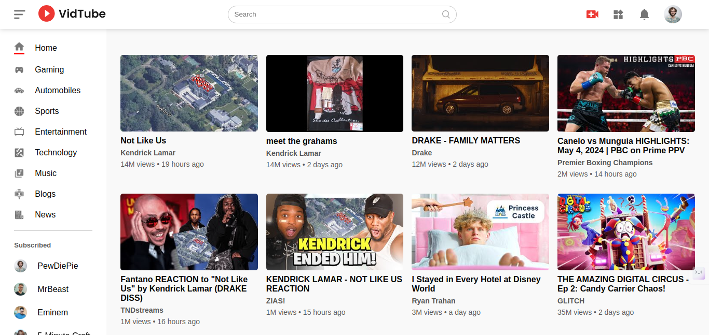
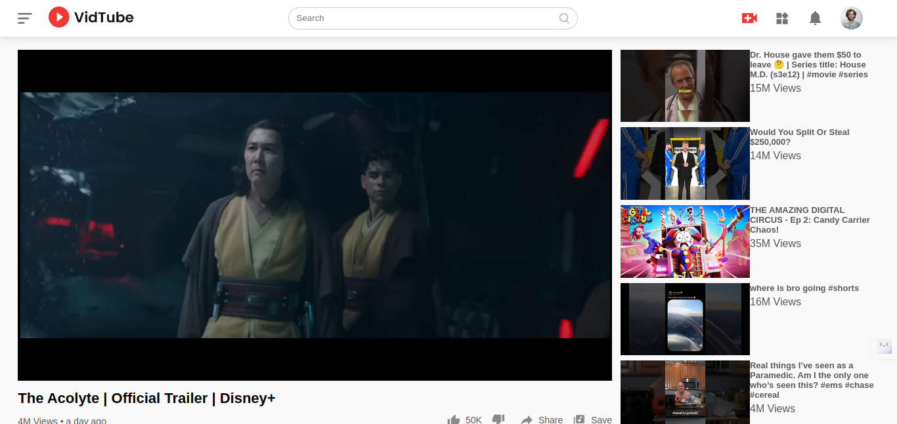
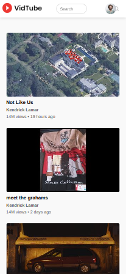
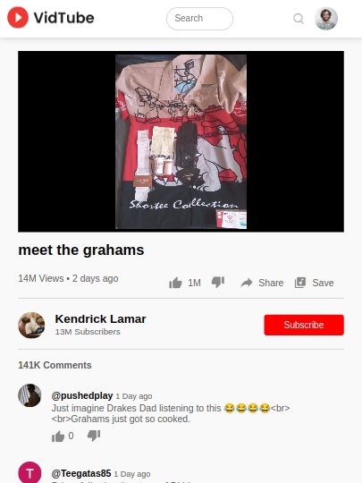

# VidTube

VidTube is a dynamic video sharing platform that leverages the power of YouTube's API to bring users an immersive experience of exploring, watching, and engaging with their favorite videos. With VidTube, discover a world of endless entertainment right at your fingertips.

## Live Project Link

Live Project Link: [VidTube](https://vidtube-avi.netlify.app/)

## Overview

VidTube is a video sharing platform that seamlessly integrates with YouTube's vast library of content. From trending music videos to captivating documentaries, users can effortlessly browse through various categories and discover videos that match their interests.

## Features

- Explore a diverse range of video categories
- Watch videos directly within the platform
- Discover recommended videos based on your preferences
- Engage with comments and interact with the community
- Access channel details for more insights

## Screenshots






## Technologies Used

- HTML, CSS and Javascript
- React
- React Router DOM
- YouTube API v3
- Vite

## Installation

To run VidTube locally, follow these simple steps:

1. Clone the repository:

```bash
git clone <repository-url>
```

2. Navigate to the project directory:

```bash
cd vidtube
```

3. Install the dependencies:

```bash
npm install
```

4. Set up the YouTube API key:

   - Go to the Google Cloud Console.
   - Create a new project.
   - Enable the YouTube Data API v3 for your project.
   - Generate an API key.
   - Replace the placeholder API key in the project code with your own.

5. Start the development server:

```bash
npm run dev
```
